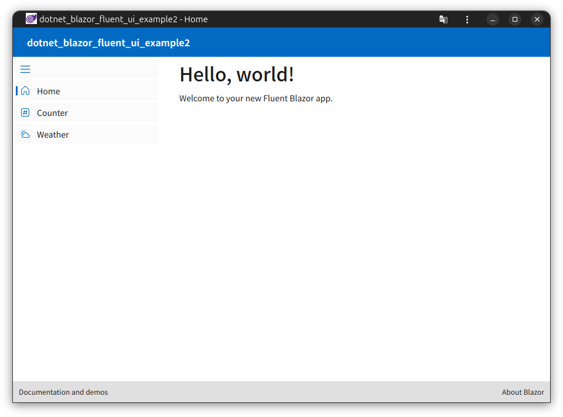

# dotnet_blazor_fluent_ui_example2

## 概要
* Microsoft Fluent UI Blazor components の fluentblazorwasm テンプレートの構成確認
* blazorwasm と fluentblazorwasm テンプレートの構成差異調査
* PWA オプションあり



Microsoft Fluent UI Blazor components  
https://github.com/microsoft/fluentui-blazor  

Fluent UI Blazor Demo site  
https://www.fluentui-blazor.net/  

Tobotobo - Fluent UI 関連のプロジェクト  
https://github.com/Tobotobo/my_knowledge_base/issues/27  

## 環境
* ubuntu.24.04-x64
* dotnet 8.0.108
* Microsoft.FluentUI.AspNetCore.Templates::4.9.3

## プロジェクト作成
```
dotnet new gitignore
dotnet new blazorwasm --pwa
dotnet new fluentblazorwasm --pwa
```

## blazorwasm テンプレートと fluentblazorwasm テンプレートの差異

※差異の詳細は https://github.com/Tobotobo/dotnet_blazor_fluent_ui_example2/commit/e81cb2c198197626e1df42863455016e71510d4d?diff=split&w=1 参照

### App.razor
* `<FocusOnNavigate RouteData="@routeData" Selector="h1" />` 追加

### Layout/MainLayout.razor
* Fluent コンポーネントに置き換え

### Layout/MainLayout.razor.css
* 削除

### Layout/NavMenu.razor
* Fluent コンポーネントに置き換え

### Layout/NavMenu.razor.css
* 削除

### Pages/Counter.razor
* Fluent コンポーネントに置き換え

### Pages/Home.razor
* Welcome に Fluent Blazor の文言追加

### Pages/Weather.razor
* Fluent コンポーネントに置き換え　※table から FluentDataGrid に変更
* forecasts を配列から IQueryable に変更

### Program.cs
* `using Microsoft.FluentUI.AspNetCore.Components;` 追加
* `builder.Services.AddFluentUIComponents();` 追加

### _Imports.razor
* `@using Microsoft.FluentUI.AspNetCore.Components` 追加

### dotnet_blazor_fluent_ui_example2.csproj
* `<PackageReference Include="Microsoft.FluentUI.AspNetCore.Components" Version="4.*-* " />` 追加
* `<PackageReference Include="Microsoft.FluentUI.AspNetCore.Components.Icons" Version="4.*-* " />` 追加

### wwwroot/css/app.css
* `@import '/_content/Microsoft.FluentUI.AspNetCore.Components/css/reboot.css';` 追加
* 全体的に変更あり

### wwwroot/bootstrap
* フォルダごと削除

### wwwroot/index.html
* `<link rel="stylesheet" href="css/bootstrap/bootstrap.min.css" />` 削除
* `<link href="_content/Microsoft.FluentUI.AspNetCore.Components/css/reboot.css" rel="stylesheet" />` 追加
* `<link rel="icon" type="image/x-icon" href="favicon.ico" />` png から icon に変更
* `<a href="." class="reload">Reload</a> ` "." ドット追加
* `<span class="dismiss">🗙</span>` a から span に変更